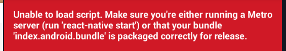
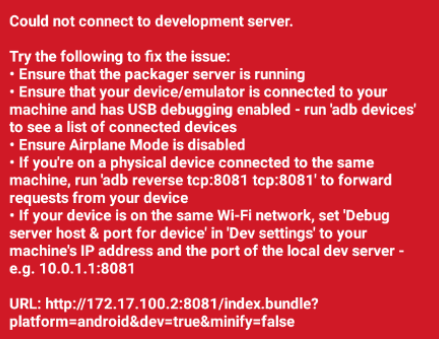

# RN常见问题

### 1、

> Error:Execution failed for task':app:transformDexArchiveWithExternalLibsDexMergerForDebug
>
> #### 解答：
>
> 在android>app下的build.gradle文件中的 defaultConfig添加 “multiDexEnabled true”

### 2、

> Deprecated Gradle features were used in this build,making it incompatible with Gradle 6.0
>
> #### 解答：
>
> 将项目的android>gradle>wrapper>gradle-wrapper.properties文件中 distributionUrl 变量中的gradle版本改成 6.0

### 3、配地址和端口

> #### 解答：
>
> 按菜单键或者摇一摇，在弹框中找到 setting ，设置 debug server host & port for device, 输入172.17.100.2:8081(或者输入自己电脑 ip+8081)

### 4、配完地址白屏

> 配置完地址，返回，重新 reload ，一直白屏
>
> #### 解答：
>
> 别的都不要动，重启模拟器，点开App即可

### 5、不能连接服务

> #### 解答：
>
> 如果没有配地址就按第 3 个问题配地址，这个是配了地址的，最底下显示着配好的地址，还不能连接服务，说明服务关了，项目中执行 npm start，完后 reload

### 6、

> #### 解答：
>
> 服务器返回 500 ，说明服务器没启动成功，是你代码有问题，看看服务的窗口报的错，对应改正

### 7、连接设备

> 执行 react-native run-android 之前可以执行 adb devices  ，查看你电脑连接的设备，如果没有设备，你执行 adb connect 127.0.0.1:62001