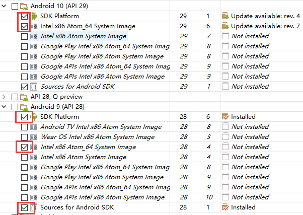
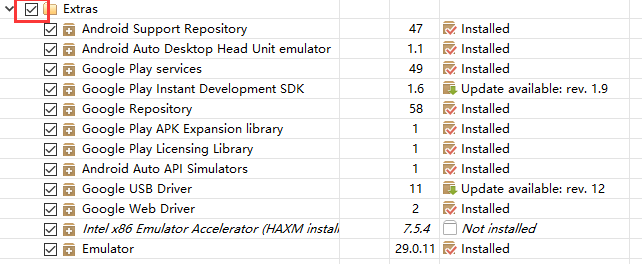

# 开发环境搭建

## 平台要求

- Windows  ---> android
- macOS ---> android or ios

## 安装依赖（Android环境）

- 安装 Node（版本大于10）, Python2.x

- 安装 JDK

  1. 官网：http://www.oracle.com/technetwork/Java/javase/downloads/index.html

  

  2. 选择版本（Java SE 8 版本）。

  

  3. 双击-安装。

  4. 配置环境变量：计算机——属性——高级系统设置——环境变量。

  5. 新建一个系统环境变量，变量名为 JAVA_HOME，变量值为 JDK 的安装路径（bin文件夹所在目录）。

  6. 在系统变量中找到Path，将 %JAVA_HOME%\bin 添加进去

  7. 检查是否配置成功。打开命令行窗口，输入 javac –version，是否出现版本号（如果不成功，可以将第 5、6 步省去，换成直接将 JDK 的安装目录添加进 Path，例如将 C:\Program Files\Java\jdk1.8.0_161\bin 添加进 Path）。

- 安装 SDK

  1. 官网：http://www.androiddevtools.cn，往下滚动，找到SDK Tools下载下图中所示压缩包，无需安装，只需解压到一个目标路径，不能是中文。

     

  2. 然后双击“SDK Manager”，启动SDK Manager。

  3. 勾选红框标出的复选框，点击右下角 **install packages **按钮下载。

     > 注意：
     >
     > 1. Android SDK Build-tools必选28.0.3版，这是RN要求的版本，同时可多选几个其余版本一同下载；
     >
     > 2. SDK Platform ：28版本以下不用安装，29可一同安装上，
     >
     >    Intel x86 Atom_64 System Image 是官方模拟器镜像文件，使用非官方模拟器不需要安装此组件，本教程可不用
     >
     > 3. Extras 全部安装

     

     

     

     

  4. 创建环境变量：新建一个系统环境变量，变量名为ANDROID_SDK_ROOT，变量值为SDK的存放路径（即 SDK Manager.exe所在目录）。

     

  5. 将 tools 和 platform-tools 添加进 Path 环境变量里，可如下图直接添加，也可利用 步骤 4 中的 ANDROID_SDK_ROOT 变量。

     

  6. 检查是否配置成功，在命令行输入 adb，输出版本信息则为成功。

- 配置 gradle。RN 最后打包需要 gradle 。无需安装，只需解压到一个目标路径下，然后配置环境变量，直接将路径添加到 Path 系统环境变量后面，如： D:\Program Files\gradle-4.5\bin

## 安装模拟器

- 安装 Android 模拟器（夜神模拟器）

## 创建-运行项目

- 使用 React Native 内建的命令行工具来创建一个新项目。这个命令行工具不需要安装，可以直接用node自带的`npx`命令来使用

```
npx react-native init ProjectName
```

- 进入项目，运行项目（确保已打开模拟器或连接手机真机）

```
yarn react-native run-android
```


